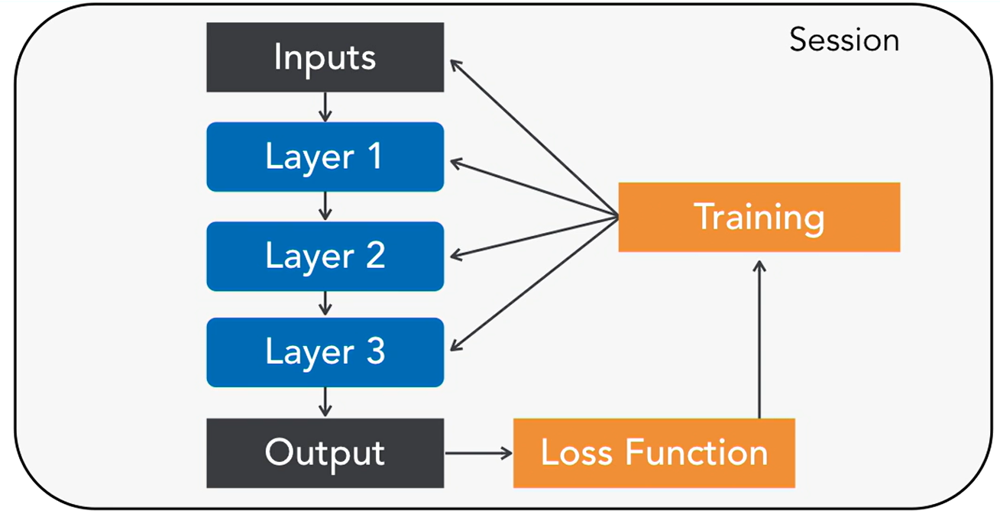

# Tensorflow Application to Predict Earnings


This project will create a TF model to predict earnings from an imaginary company given a list of data with the earnings.
This project created using Python 3 and will need the following libraries installed:
1. Tensorflow (creating the neural network model)
2. pandas (for reading CSV file)
3. sklearn (for normalising data)

All the data taken was from the course: 
Building and Deploying Deep Learning Applications with TensorFlow by Adam Geitgey 
: https://www.linkedin.com/learning/building-and-deploying-deep-learning-applications-with-tensorflow/the-train-test-evaluation-flow-in-tensorflow?autoplay=true&resume=false&u=85880466


# How it will work

We have a list of data of 2 CSV data. One for training and one for testing the trained model.
Panda will be used to input the CSV files and then the data will be scaled.
Using Tensorflow with the data, a model will be created and then compared with the test data.
Tensorboard will be used to visualise the process.
Using the trained model, the test data can be inputted into the model without training the model every time.


(Fig.1) Higher level diagram of a standard neural network model.


# Goal of project
We will see that the real earnings are in comparision to the earnings that the neural netwrok predicted using the same data.
We can then see the accuracy of the trained model that can be used for a dataset of similar kind.


# Steps
1. Load csv data using pandas to create an array of the data.
2. Create one axis for all the input values (x axis) and an axis for the total earnings values (y-axis).

3. Load in testing data and create an the same x and y axis as before with this data.

4. Normalise the data with sklearn by scaling all input values from before as a number between 0-1.

5. Define parameters of the neural network.

6. Create a loss function.

7. Create a optimizer.

8. Create logging graphs to visulise the model.

9. Run the session, save logs as different files for comparing and print out final testing cost of both the train and test data to compare.

10. (Optional) Print out the training cost every 5 epoch (training loop)

11. (Optional) Run the trained model and predict results.


# Logging
To create logging, use: 
1.training_writer = tf.summary.FileWriter("./logs/{}/training".format(RUN_NAME), session.graph) ... For training logs
2.testing_writer = tf.summary.FileWriter("./logs/{}/testing".format(RUN_NAME), session.graph) ... For test logs

3. Create a logging at every 5 epoch loop:

````
```
for epoch in range(training_epochs):

        # Feed in the training data and do one step of neural network training
        session.run(optimizer, feed_dict={X: X_scaled_training, Y: Y_scaled_training})

        #===================================
        # LOGGING AFTER EVERY EPOCHS
        #===================================
        # Every few training steps (EPOCHs), log our progress
        if epoch % 5 == 0:
            # Get the current accuracy scores by running the "cost" operation on the training and test data sets
            # GETS CURRENT
            # GET TRAINING COST FOR EVEY 5 EPOCJ LOOP
            # CALL THE COST FUNCTION
            # ADD IN , SUMMARY TO GET SUMMARY INFO AS WELL IN ONE GO
            training_cost, training_summary = session.run([cost, summary], feed_dict={X: X_scaled_training, Y:Y_scaled_training})
            testing_cost, testing_summary = session.run([cost, summary], feed_dict={X: X_scaled_testing, Y:Y_scaled_testing})

            # Write the current training status to the log files (Which we can view with TensorBoard)
            training_writer.add_summary(training_summary, epoch)
            testing_writer.add_summary(testing_summary, epoch)

            # Print the current training status to the screen
            print("Epoch: {} - Training Cost: {}  Testing Cost: {}".format(epoch, training_cost, testing_cost))
```
````
4. Type in terminal:
tensorboard --logdir=05/logs ... where 05/logs is the directoruy in this case.
